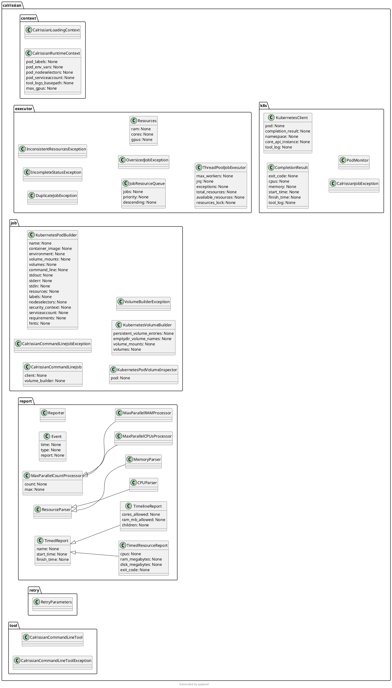

Calrissian class diagram

```puml
@startuml
left to right direction
!pragma useIntermediatePackages false

class calrissian.context.CalrissianLoadingContext {
}
class calrissian.context.CalrissianRuntimeContext {
  pod_labels: None
  pod_env_vars: None
  pod_nodeselectors: None
  pod_serviceaccount: None
  tool_logs_basepath: None
  max_gpus: None
}
class calrissian.executor.DuplicateJobException {
}
class calrissian.executor.IncompleteStatusException {
}
class calrissian.executor.InconsistentResourcesException {
}
class calrissian.executor.JobResourceQueue {
  jobs: None
  priority: None
  descending: None
}
class calrissian.executor.OversizedJobException {
}
class calrissian.executor.Resources {
  ram: None
  cores: None
  gpus: None
}
class calrissian.executor.ThreadPoolJobExecutor {
  max_workers: None
  jrq: None
  exceptions: None
  total_resources: None
  available_resources: None
  resources_lock: None
}
class calrissian.job.CalrissianCommandLineJob {
  client: None
  volume_builder: None
}
class calrissian.job.CalrissianCommandLineJobException {
}
class calrissian.k8s.CompletionResult {
  exit_code: None
  cpus: None
  memory: None
  start_time: None
  finish_time: None
  tool_log: None
}
class calrissian.k8s.KubernetesClient {
  pod: None
  completion_result: None
  namespace: None
  core_api_instance: None
  tool_log: None
}
class calrissian.job.KubernetesPodBuilder {
  name: None
  container_image: None
  environment: None
  volume_mounts: None
  volumes: None
  command_line: None
  stdout: None
  stderr: None
  stdin: None
  resources: None
  labels: None
  nodeselectors: None
  security_context: None
  serviceaccount: None
  requirements: None
  hints: None
}
class calrissian.job.KubernetesPodVolumeInspector {
  pod: None
}
class calrissian.job.KubernetesVolumeBuilder {
  persistent_volume_entries: None
  emptydir_volume_names: None
  volume_mounts: None
  volumes: None
}
class calrissian.report.Reporter {
}
class calrissian.report.TimedResourceReport {
  cpus: None
  ram_megabytes: None
  disk_megabytes: None
  exit_code: None
}
class calrissian.job.VolumeBuilderException {
}
class calrissian.k8s.CalrissianJobException {
}
class calrissian.k8s.PodMonitor {
}
class calrissian.report.CPUParser {
}
class calrissian.report.MemoryParser {
}
class calrissian.report.Event {
  time: None
  type: None
  report: None
}
class calrissian.report.MaxParallelCPUsProcessor {
}
class calrissian.report.MaxParallelCountProcessor {
  count: None
  max: None
}
class calrissian.report.MaxParallelRAMProcessor {
}
class calrissian.report.ResourceParser {
}
class calrissian.report.TimedReport {
  name: None
  start_time: None
  finish_time: None
}
class calrissian.report.TimelineReport {
  cores_allowed: None
  ram_mb_allowed: None
  children: None
}
class calrissian.retry.RetryParameters {
}
class calrissian.tool.CalrissianCommandLineTool {
}
class calrissian.tool.CalrissianCommandLineToolException {
}
calrissian.report.TimedReport <|-- calrissian.report.TimedResourceReport
calrissian.report.ResourceParser <|-- calrissian.report.CPUParser
calrissian.report.ResourceParser <|-- calrissian.report.MemoryParser
calrissian.report.MaxParallelCountProcessor <|-- calrissian.report.MaxParallelCPUsProcessor
calrissian.report.MaxParallelCountProcessor <|-- calrissian.report.MaxParallelRAMProcessor
calrissian.report.TimedReport <|-- calrissian.report.TimelineReport
footer Generated by //py2puml//
@enduml
```
